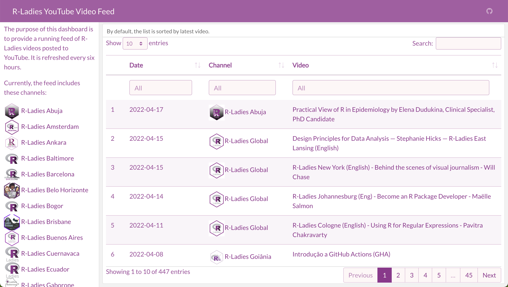

# R-Ladies YouTube Video Feed Dashboard

<!-- badges: start -->

<!-- badges: end -->
https://ivelasq.rbind.io/blog/automated-youtube-dashboard/
This is a [flexdashboard](https://pkgs.rstudio.com/flexdashboard/) showing the most recent R-Ladies YouTube videos.

## How it works

mermaid code chunk

